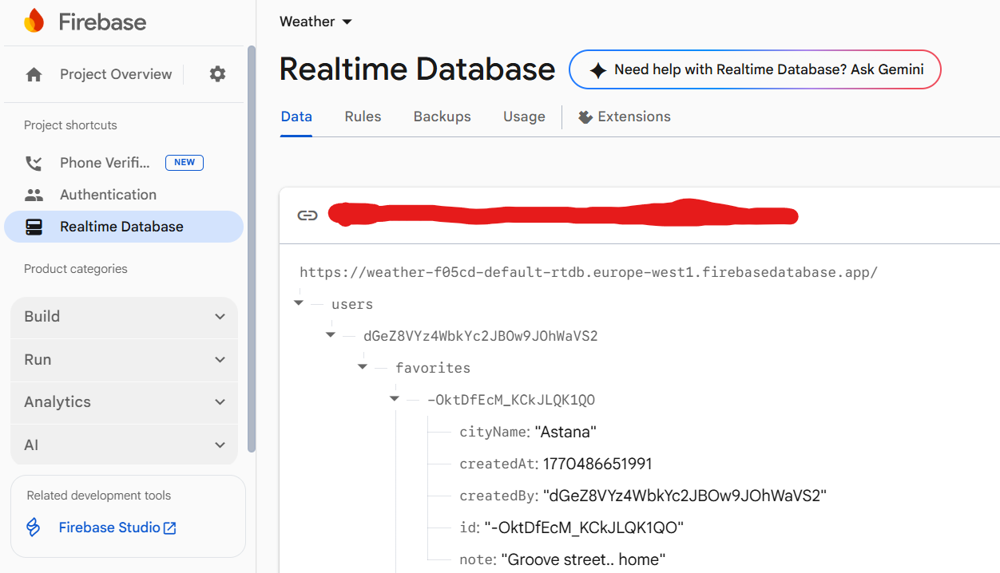
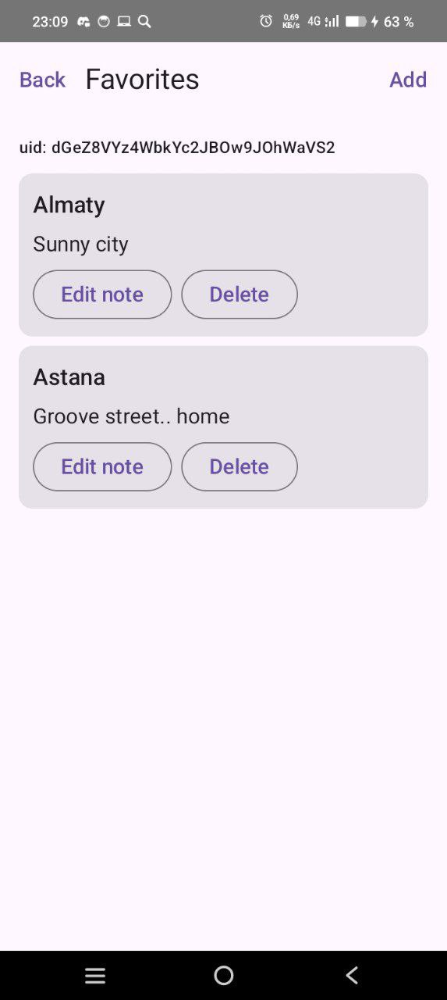

# Assignment 8 - Firebase & App Integration

## Overview
This assignment extends the Weather App from **Assignment 7** by integrating **Firebase Realtime Database** and **Firebase Authentication**.  
The app now supports a **Favorites & Notes** module with full **CRUD operations** and **real-time UI updates**.

Each user has their own list of favorite cities stored in the cloud and synchronized in real time.

---

## Firebase Setup Steps

1. Created a new project in **Firebase Console**.
2. Added an **Android app** to the Firebase project using the app’s `applicationId`.
3. Downloaded and added `google-services.json` to the `app/` directory.
4. Enabled **Anonymous Authentication** in:
   ```
   Firebase Console -> Authentication -> Sign-in method
   ```
5. Created a **Realtime Database** instance.
6. Added Firebase SDK dependencies using **Firebase BoM** in Gradle.
7. Applied the `google-services` Gradle plugin.
8. Explicitly configured the Realtime Database URL in code to ensure stable connectivity.

---

## Firebase Products Used
- **Firebase Authentication** - Anonymous Auth
- **Firebase Realtime Database**

---

## Data Model

Favorites are stored per authenticated user (`uid`) in the Realtime Database.

### Database Structure
```json
{
  "users": {
    "dGeZ8VYz4WbkYc2JBOw9JOhWaVS2": {
      "favorites": {
        "-OktDfEcM_KCkJLQK1QO": {
          "cityName": "Astana",
          "createdAt": 1770486651991,
          "createdBy": "dGeZ8VYz4WbkYc2JBOw9JOhWaVS2",
          "id": "-OktDfEcM_KCkJLQK1QO",
          "note": "Groove street.. home"
        },
        "-OktGREyGDb6qeTn6tQZ": {
          "cityName": "Almaty",
          "createdAt": 1770487377003,
          "createdBy": "dGeZ8VYz4WbkYc2JBOw9JOhWaVS2",
          "id": "-OktGREyGDb6qeTn6tQZ",
          "note": "Sunny city"
        }
      }
    }
  }
}
```

### Fields Description
- `id` - unique Firebase-generated ID
- `cityName` - name of the favorite city
- `note` - optional user note
- `createdAt` - timestamp (milliseconds)
- `createdBy` - Firebase Authentication `uid`

---

## CRUD Operations

The app implements full CRUD functionality:
- **Create** - add a favorite city with an optional note
- **Read** - observe favorites list in real time
- **Update** - edit a note for an existing favorite
- **Delete** - remove a favorite city

All operations are scoped to the authenticated user.

---

## Real-Time Updates

The Favorites screen uses **Firebase Realtime Database listeners** (`ValueEventListener`) wrapped in Kotlin `Flow`.

### Behavior
- When a favorite is added, edited, or deleted:
    - The database updates instantly
    - The UI updates automatically without manual refresh

### Evidence of Real-Time Updates
- Favorites list updates immediately after:
    - adding a new city
    - editing a note
    - deleting an item
- Changes made in Firebase Console are reflected instantly in the running app.


<p align="center">
  

  
</p>

---

## Security Rules

The following Firebase Realtime Database rules are used to ensure data security:

```json
{
  "rules": {
    "users": {
      "$uid": {
        ".read": "auth != null && auth.uid == $uid",
        ".write": "auth != null && auth.uid == $uid"
      }
    }
  }
}
```

### Explanation
- Only authenticated users can read or write data.
- Users can access **only their own data**, identified by `auth.uid`.

---

## Architecture & Integration

- The Firebase logic is encapsulated in a **Repository layer**.
- UI communicates with Firebase only through **ViewModel**.
- Real-time listeners are lifecycle-aware and automatically cleaned up.
- Existing Weather App architecture (MVVM + Repository) is preserved.

---

## Conclusion

This assignment demonstrates:
- Successful Firebase integration
- Cloud data persistence
- Real-time UI synchronization
- Secure access control
- Clean separation of concerns

The Weather App was extended without breaking existing functionality, fulfilling all Assignment 8 requirements.


